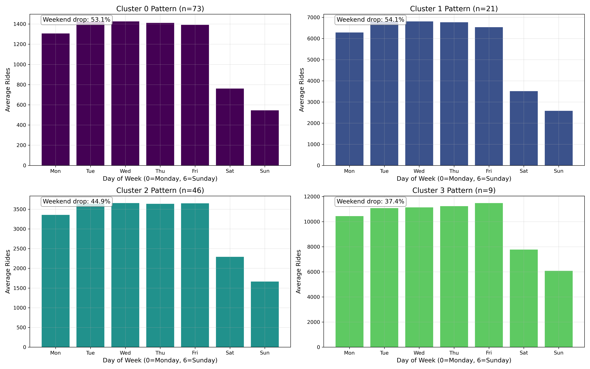
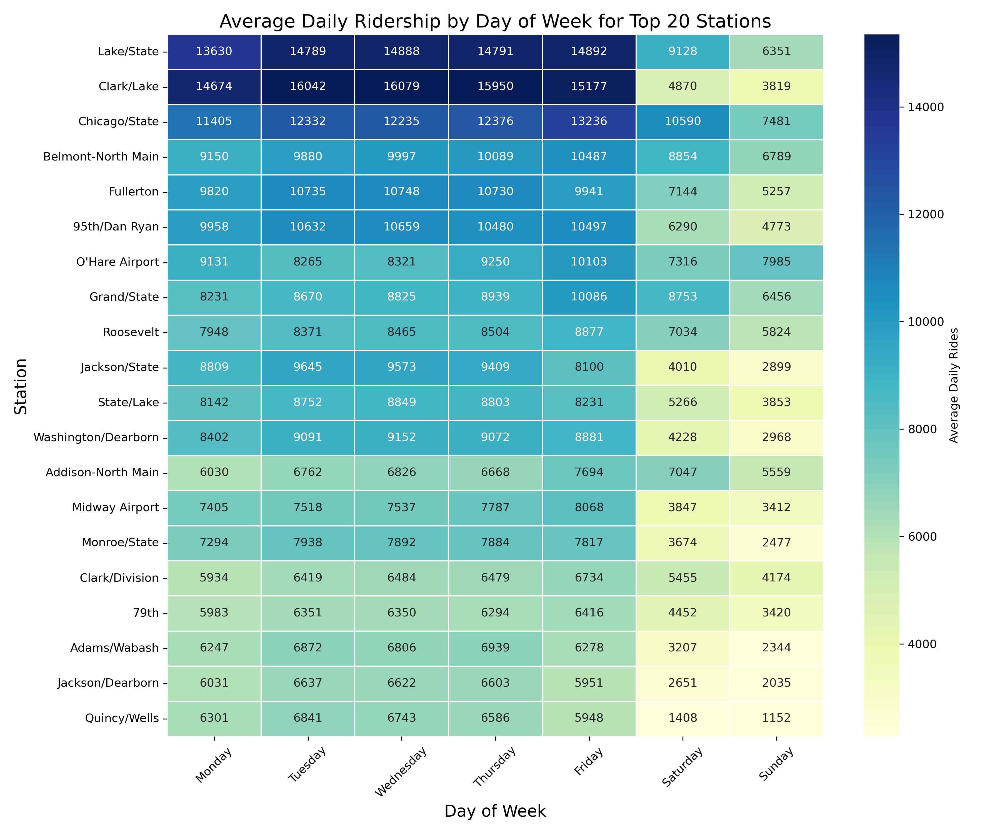
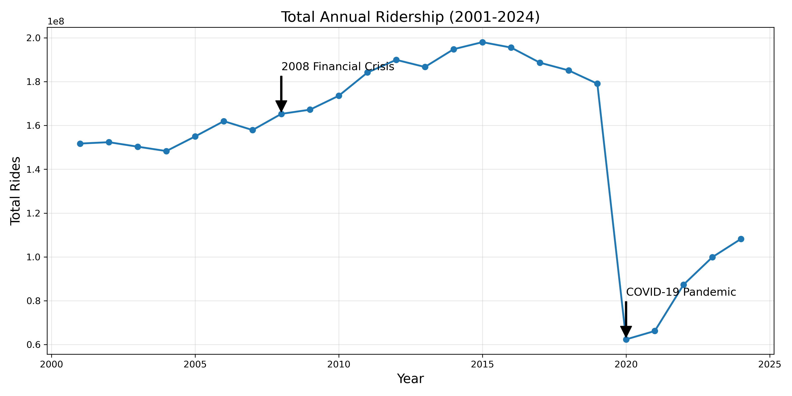
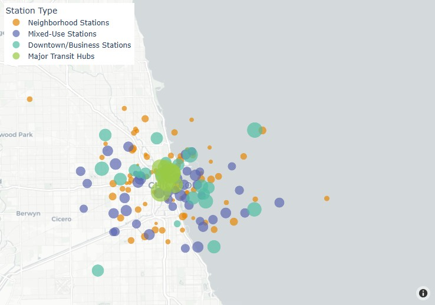
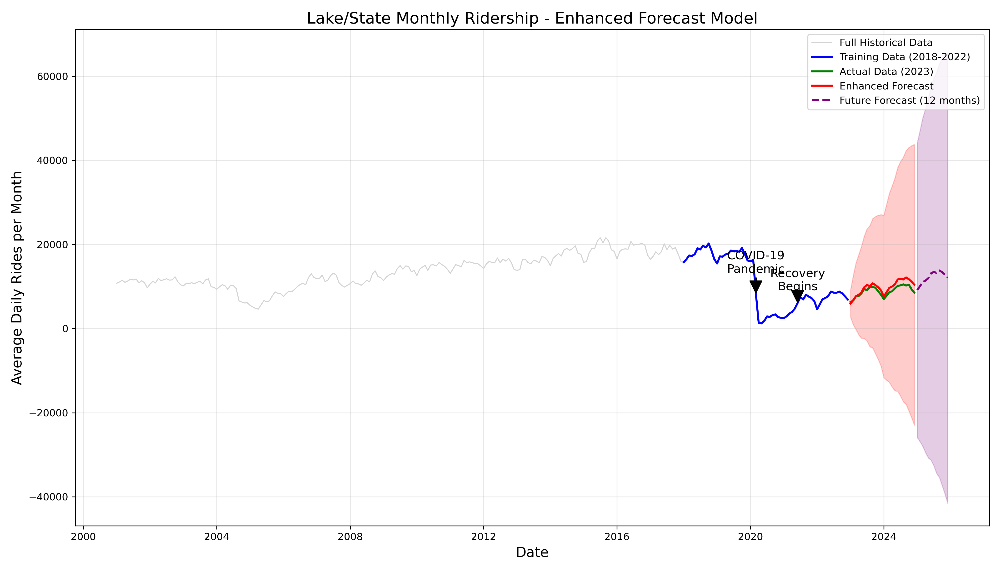
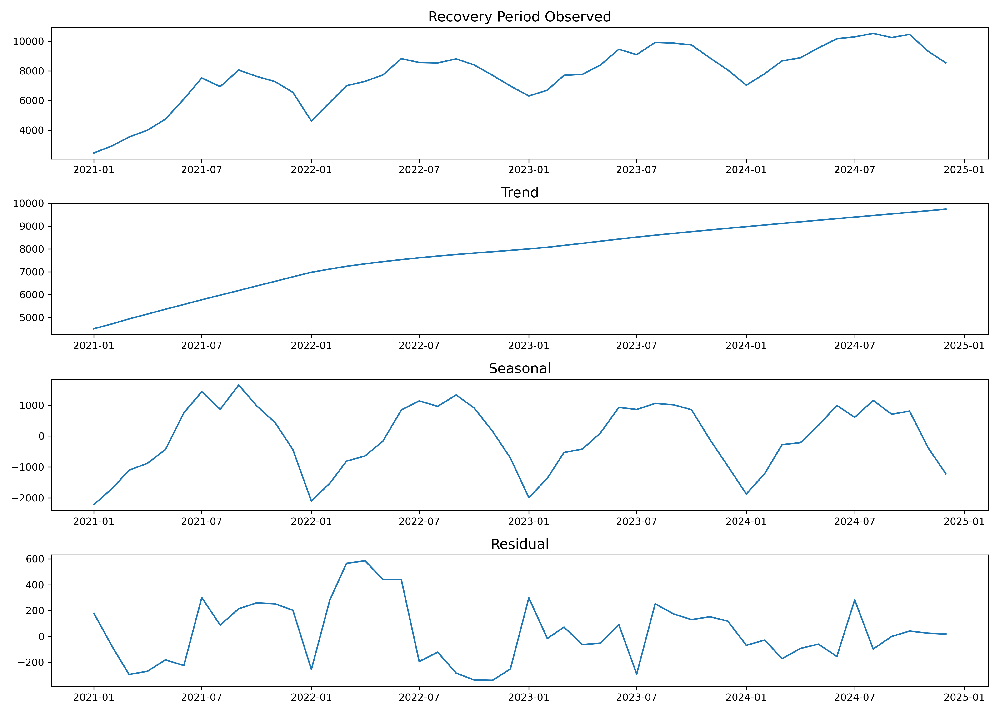
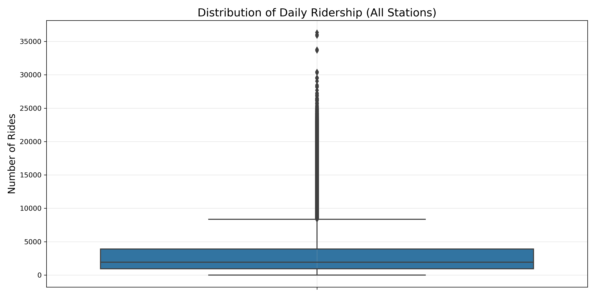

# Urban Mobility Patterns Analysis


## Overview
This project conducts an in-depth analysis of Chicago Transit Authority (CTA) ridership data spanning from 2001 to 2024. Using advanced data visualization and machine learning techniques, I explored how public transportation usage varies across Chicago's diverse neighborhoods, identified distinct station types based on usage patterns, and developed predictive models to forecast future ridership trends.

The analysis reveals fascinating insights about urban mobility patterns, the dramatic impact of the COVID-19 pandemic on public transportation, and the ongoing recovery process that continues to shape how people move throughout the city.

## Key Insights

### Four Distinct Station Types
Cluster analysis revealed that Chicago's transit stations fall into four clear categories based on their weekly usage patterns:



* **Downtown/Business Stations (21 stations)**: 
  * Characterized by very high weekday ridership (6,000-7,000 riders)
  * Sharp drops on weekends (54% decrease)
  * Include major stations like Jackson/State, State/Lake, Washington/Dearborn
  * Primarily serve commuters working in Chicago's central business district

* **Major Transit Hubs (9 stations)**:
  * Highest overall ridership levels (10,000+ riders on weekdays)
  * More balanced weekday/weekend usage (only 37% weekend drop)
  * These function as critical connection points in the network
  * Likely serve areas with mixed business, residential, and entertainment uses

* **Mixed-Use Stations (46 stations)**:
  * Medium ridership levels (3,000-3,500 riders)
  * Moderate weekend drops (45%)
  * Include stations like 69th, Damen/Milwaukee, Rosemont
  * Serve neighborhoods with diverse activity types

* **Neighborhood Stations (73 stations)**:
  * Lower overall ridership (1,200-1,400 riders)
  * Significant weekend drops (53%)
  * Include stations like Polk, Harlem-O'Hare, 35th/Archer
  * Primarily serve residential areas with less commercial activity

### Day-of-Week Patterns
The heatmap below reveals detailed day-of-week patterns across top stations:



Key observations:
* Friday typically sees the highest ridership across most stations
* Weekend ridership drops are most dramatic at downtown stations
* Some stations maintain relatively consistent usage throughout the week
* The data suggests different neighborhood purposes (business, residential, entertainment)

### Pandemic Impact & Recovery
The COVID-19 pandemic created an unprecedented disruption to transit usage patterns:



The analysis shows:
* Steady growth in ridership from 2001-2015
* Minimal impact from the 2008 financial crisis
* Catastrophic drop (>60%) during the COVID-19 pandemic
* Ongoing recovery that remains well below pre-pandemic levels
* Changing patterns in how and when people use public transportation

### Geographic Distribution
The spatial distribution of station types reveals Chicago's urban structure:


"Note: The geographical visualization uses simulated coordinates since the original dataset didn't include station locations. In a real-world application, actual station coordinates would be used."
* Downtown stations form a dense cluster in the city center
* Neighborhood stations create rings around the central business district
* Major transit hubs often appear at critical junctions between different areas
* The geographical patterns align with Chicago's historical development

## Advanced Forecasting Model

One of the most challenging aspects of post-pandemic transit planning is predicting future ridership levels. I developed and compared multiple forecasting approaches, ultimately creating an enhanced model that significantly outperforms basic methods.

### Model Performance Comparison

| Metric | Basic Approach | Enhanced Approach | Improvement |
|--------|------------------|-------------------|-------------|
| Mean Absolute Error (MAE) | 2,067.41 | 926.65 | 55.2% |
| Root Mean Squared Error (RMSE) | 2,332.30 | 1,083.98 | 53.5% |
| Mean Absolute Percentage Error (MAPE) | Not calculated | 10.11% | N/A |



### Methodological Improvements
The enhanced approach demonstrates several advanced techniques:

1. **Model Selection**: Tested multiple SARIMA configurations and selected the optimal model (SARIMA(2,1,1,1,1,0,12)) based on AIC
2. **Parameter Optimization**: Used ACF/PACF analysis to identify appropriate parameters
3. **Training Strategy**: Emphasized recent data (2018-2022) to better capture post-pandemic patterns
4. **Uncertainty Quantification**: Provided clear confidence intervals for planning purposes

### Recovery Pattern Analysis



The time series decomposition of the recovery period reveals:
* A steady upward trend since 2021 with no signs of plateauing
* Consistent seasonal patterns with summer peaks and winter troughs of approximately ±2,000 riders
* Small and largely random residuals, indicating the model captures most systematic variations
* Projections suggesting continued growth but not reaching pre-pandemic levels until approximately 2026

## Data Validation & Quality Assessment

Rigorous data validation was conducted to ensure reliable analysis:



Key validation findings:
* The dataset contains over 1.25 million records spanning 2001-2024
* Ridership values range from 0 to 36,323 daily riders
* Outliers were identified and analyzed, revealing primarily legitimate special events
* The Belmont-North Main station shows several extreme ridership days, most occurring on weekends in June
* Data quality is generally high with consistent collection methods throughout the period

## Methodology & Techniques

### Data Processing
* Pandas for cleaning and transformation of the 1.25+ million record dataset
* Multiple aggregation levels: daily, weekly, monthly, and annual views
* Careful handling of temporal features to support time-based analysis

### Visualization Approaches
* Matplotlib and Seaborn for statistical visualizations
* Plotly for interactive geospatial mapping
* Custom color schemes to enhance interpretability
* Multiple visualization types to highlight different aspects of the data

### Machine Learning Implementation
* Scikit-learn for K-means and hierarchical clustering
* Standard scaling to normalize features before clustering
* Elbow method and silhouette scoring for optimal cluster selection
* Cross-validation of clustering results with alternative methods

### Time Series Analysis
* SARIMA modeling with parameter optimization
* ACF/PACF analysis for model specification
* Train/test splitting for forecast validation
* Industry-standard error metrics (MAE, RMSE, MAPE)
* Seasonal decomposition using STL method

## Practical Applications

This analysis has several practical applications for urban planning and transit management:

* **Service Optimization**: Tailoring service frequency based on station type and temporal patterns
* **Resource Allocation**: Focusing maintenance and improvement efforts where they'll have the most impact
* **Recovery Planning**: Setting realistic expectations for post-pandemic ridership recovery
* **Future Development**: Guiding transit-oriented development based on station usage characteristics
* **Emergency Preparedness**: Better understanding how ridership responds to major disruptions

## Repository Structure
```
urban_mobility_analysis/
├── urban_mobility_analysis.ipynb  # Main analysis notebook
├── data/                          # Dataset folder
│   └── CTA_ridership.csv          # Chicago Transit Authority ridership data
├── visualizations/                # Generated visualizations
│   ├── monthly_ridership_trends.png
│   ├── recent_ridership_trends.png
│   ├── dow_heatmap.png
│   ├── weekend_drop.png
│   ├── chicago_station_map.html
│   ├── chicago_station_clusters_map.html
│   ├── cluster_patterns.png
│   ├── elbow_curve.png
│   ├── ridership_distribution.png
│   ├── lake_state_decomposition.png
│   ├── lake_state_forecast.png
│   ├── lake_state_acf_pacf.png
│   ├── lake_state_enhanced_forecast.png
│   └── lake_state_recovery_decomposition.png
└── requirements.txt               # Required packages
```

## Setup and Usage

```bash
# Clone the repository
git clone https://github.com/yourusername/urban-mobility-analysis.git

# Navigate to project directory
cd urban-mobility-analysis

# Install required packages
pip install -r requirements.txt

# Open the notebook
jupyter lab urban_mobility_analysis.ipynb
```

## Future Research Directions
The current analysis opens several promising avenues for future work:

* **External Factors**: Incorporate weather data, special events, and economic indicators
* **Network Analysis**: Explore transfer patterns between stations
* **Demographic Integration**: Analyze how neighborhood demographics influence transit usage
* **Alternative Transport Modes**: Compare with rideshare, bike share, and scooter usage data
* **Deep Learning Approaches**: Implement LSTM or transformer models for improved long-term forecasting

## Dataset
This analysis uses the Chicago Transit Authority (CTA) ridership dataset, which provides daily entry totals for each station in Chicago's "L" train system from 2001-2024. The dataset is publicly available through the City of Chicago Data Portal.

## Acknowledgments
I would like to acknowledge the City of Chicago and the Chicago Transit Authority for making this data publicly available, enabling valuable research into urban mobility patterns.